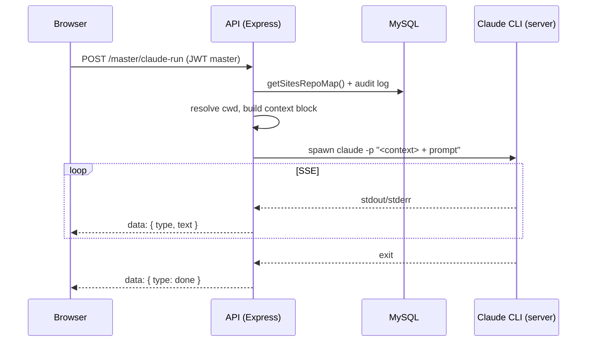

# Claude Code integration — full reference

This document describes the **Claude Code** integration in the Master Hub: how the dashboard runs the Claude CLI on the server, how authentication and safeguards work, and how to operate and extend it. It reflects the **current implementation** and maps plan actions to status (done vs pending).

**See also:** [PROJECT_CONTEXT.md](PROJECT_CONTEXT.md) — Admin Dashboard and *Claude Code integration* section. [docs/COMPREHENSIVE_PLAN.md](docs/COMPREHENSIVE_PLAN.md) — Consolidated plan including Claude goals and roadmap.

---

## 1. Overview

- **What it is:** The Master Hub at `/admin/master/` includes a **Claude Code** tab. A master user submits a task (prompt) and chooses a **repository** (one of the registered sites). The API spawns the **Claude CLI** on the server in that repo’s directory and streams the CLI output back to the browser via Server-Sent Events (SSE).
- **Purpose:** Run Claude Code (same model and behaviour as in Cursor/VS Code) from the browser against any of your multi-site repos, with **full autonomy** (no permission allow-list) and with **all domains** injected into context so Claude is aware of every site.
- **Access:** Only users with `role = 'master'` can open `/admin/master` or call any `/master/*` API. Strong safeguards (audit log, rate limits, optional IP allow-list) protect this control plane.
- **Auth/me:** `GET /auth/me` returns `{ user, is_master }` so the frontend can use one call for both user info and master check.

---

## 1.1 Implementation status (from plan)

All items from the Claude Code access plan that were committed are implemented. Optional or later items remain pending.

| Plan item | Status | Notes |
|-----------|--------|--------|
| Document current access | Done | PROJECT_CONTEXT + this doc + COMPREHENSIVE_PLAN |
| All domains in UI and backend | Done | Repo list from `sites`, `GET /master/claude-repos`, frontend dropdown from API, `cwd` resolved in claude-run |
| All domains in context | Done | Context block built in `POST /master/claude-run` and prepended to prompt |
| Full autonomy | Done | `--dangerously-skip-permissions` kept; no permission file alignment with local |
| Master-only role + requireMaster + frontend | Done | `schema_master_role.sql`, `requireMaster` on all `/master/*` except GET /master/me; frontend master check, redirect, hide “Master Hub” link |
| Audit logging | Done | `master_audit_log` table; middleware logs every `/master/*` request; claude-run meta: repo, taskId, prompt_length, prompt_preview |
| Rate limiting | Done | `claudeRunRateLimiter` on POST /master/claude-run (default 10/user/hour, `MASTER_CLAUDE_RUN_LIMIT`) |
| IP allow-list | Done | Optional `MASTER_ALLOWED_IPS`; middleware runs before requireMaster; uses `X-Forwarded-For` or req.ip |
| Step-up auth | Pending (optional, later) | Re-enter password or 2FA to open Master Hub |
| Session / token (shorter JWT or separate master token) | Pending (optional) | Can be added later for tighter time limits on master access |
| Permissions parity with local | Not planned | We keep full autonomy; no use of repo `.claude/settings.local.json` on server |

**Out of scope (for later):** Multi-repo in one task; WebFetch allow-list for all site URLs; `repo_path` column on `sites` (convention path is used).

---

## 2. Architecture



- **Frontend:** [src/pages/admin/master.astro](src/pages/admin/master.astro) — Claude Code tab: repo dropdown (from `GET /master/claude-repos`), model selector, account selector, prompt textarea, Run/Kill, and an output area that consumes SSE.
- **Backend:** [api/src/routes/master.js](api/src/routes/master.js) — All Claude-related routes and the spawn/SSE logic; uses [api/src/middleware/auth.js](api/src/middleware/auth.js) (`requireMaster`) and [api/src/middleware/rateLimit.js](api/src/middleware/rateLimit.js) (`claudeRunRateLimiter`).
- **Data:** Repo list and working directory are derived from the **sites** table (convention: repo path = `/home/theartis/repositories/<domain>`). No separate “Claude repos” table.

---

## 3. API endpoints (Claude-related)

All require `Authorization: Bearer <JWT>` with a user that has `role = 'admin'` or `'master'`; only `role = 'master'` can call routes other than `GET /master/me`. `GET /auth/me` also returns `is_master` for the current user.

| Method | Path | Purpose |
|--------|------|---------|
| GET | `/master/me` | Returns `{ is_master }` for current user (no requireMaster). |
| GET | `/master/claude-repos` | List repos for the Claude tab: `[{ id, name, domain, repo_path }]` from active sites. |
| GET | `/master/claude-accounts` | List Claude config dirs: default `~/.claude` plus any `CLAUDE_CONFIG_DIR_*` env vars. |
| GET | `/master/claude-auth-status?account_dir=...` | Check if the given account dir has valid OAuth credentials. |
| POST | `/master/claude-run` | Run Claude CLI; body: `{ prompt, repo, model, account_dir?, timeout_min? }`; response: SSE stream. |
| DELETE | `/master/claude-run/:taskId` | Kill a running Claude task. |
| POST | `/master/claude-auth-start` | Start OAuth flow; body: `{ account_dir? }`; returns `{ url, account_dir }` for user to open. |
| POST | `/master/claude-auth-code` | Complete OAuth; body: `{ code }`; writes credentials to `account_dir`. |

---

## 4. Run flow (POST /master/claude-run)

1. **Auth & rate limit:** `requireAuth` → `requireMaster` → `claudeRunRateLimiter` (default 10 runs per user per hour).
2. **Resolve repo:** Load active sites, build map `domain → /home/theartis/repositories/<domain>`. Resolve `req.body.repo` (domain or site id) to `cwd`. If missing or path not readable, return 400.
3. **Context block:** Build a short text block listing all sites (name, domain, api_url, admin_url, repo_path) and “Current repo for this task: &lt;repo&gt;”. Prepend this to the user prompt so Claude sees all domains every run.
4. **Spawn:** Run the Claude CLI binary (`CLAUDE_BIN`) with:
   - `--print` — print output (no interactive TTY).
   - `--dangerously-skip-permissions` — full autonomy (no allow-list).
   - `--model` — from `MODEL_MAP` (haiku/sonnet/opus).
   - `-p` — the full prompt (context block + user prompt).
   - `cwd` — the chosen repo directory.
   - Env: `CLAUDE_CONFIG_DIR`, `CLAUDE_CODE_OAUTH_TOKEN` (from account’s `.credentials.json`), `GH_TOKEN`, `CI=1`, `TERM=dumb`, and various “no update” vars.
5. **SSE:** Stream CLI stdout/stderr as `data: { type: 'out'|'err', text }`, then `data: { type: 'done', code }`. One task at a time per server; 409 if a task is already running.
6. **Audit:** Every `/master/*` request is logged to `master_audit_log`; for claude-run, meta includes repo, taskId, prompt_length, prompt_preview.

---

## 5. Authentication (Claude Pro OAuth)

The runner uses **Claude Pro (OAuth)** on the server, not `ANTHROPIC_API_KEY`. The API deletes `ANTHROPIC_API_KEY` from the spawn environment so the CLI uses the OAuth session.

- **First-time setup (server):** Either run `claude auth login` in a TTY on the server, or use the Master Hub **Auth Account** flow:
  1. In the Claude tab, open “Auth Account”.
  2. Click **Generate Auth URL**, open the URL in a browser, sign in at claude.ai.
  3. Copy the “Authentication Code” from the callback page and paste it into the dashboard, then **Submit Code**.
- **Credentials:** Stored under the chosen **account dir** (default `/home/theartis/.claude/`):
  - `.credentials.json` — OAuth tokens (format expected by Claude CLI).
  - `.claude.json` — optional; `oauthAccount` is written after profile fetch for display (email, etc.).
- **Multi-account:** Set env vars like `CLAUDE_CONFIG_DIR_WORK=/home/theartis/.claude-work`. The dashboard lists all `CLAUDE_CONFIG_DIR_*` as account options.

---

## 6. Safeguards

- **Master-only access:** `requireMaster` on all `/master/*` routes except `GET /master/me`. Frontend hides “Master Hub” for non-master and redirects direct visits to `/admin/master` to the dashboard with “Kun master-brugere har adgang”.
- **Audit log:** Table `master_audit_log` (user_id, email, path, method, meta, ip, created_at). For `POST /master/claude-run`, meta includes repo, taskId, prompt_length, prompt_preview. Implemented in [api/src/routes/master.js](api/src/routes/master.js) (middleware that runs on every master route).
- **Rate limiting:** `POST /master/claude-run` is limited per user per hour (default 10; env `MASTER_CLAUDE_RUN_LIMIT`). Response 429 with message “For mange Claude-kørsler. Prøv igen om en time.” and code `CLAUDE_RUN_RATE_LIMIT`.
- **Optional IP allow-list:** If `MASTER_ALLOWED_IPS` (comma-separated) is set, only those IPs can reach any `/master/*` endpoint; others get 403 `IP_NOT_ALLOWED`. Client IP is taken from `X-Forwarded-For` (first value) or `req.ip`. Middleware runs before `requireAuth`/`requireMaster`.

---

## 7. Configuration and environment

| Variable | Purpose |
|----------|---------|
| (none) | Claude CLI binary path is hardcoded: `CLAUDE_BIN = '/home/theartis/local/bin/claude'`. |
| `GITHUB_PAT` | Passed as `GH_TOKEN` to the CLI so it can push and use `gh` (e.g. for deploy). |
| `MASTER_CLAUDE_RUN_LIMIT` | Max claude-run requests per user per hour (default 10). |
| `MASTER_ALLOWED_IPS` | Optional comma-separated IPs; only these can call `/master/*`. |
| `CLAUDE_CONFIG_DIR_*` | Additional account dirs shown in the account dropdown (e.g. `CLAUDE_CONFIG_DIR_WORK`). |

Repo path convention is fixed: `/home/theartis/repositories/<domain>` where `domain` comes from the `sites` table. No env override for repo base path in the current implementation.

---

## 8. Database and schema

- **sites:** Used to build the repo list and cwd. Required columns for Claude: `id`, `name`, `domain`, `api_url`, `admin_url`, `is_active`. Repo path is not stored; it is derived as `REPO_BASE + '/' + domain`.
- **users:** Must include role `master`. Run [api/src/schema_master_role.sql](api/src/schema_master_role.sql) to extend `role` to `ENUM('user','admin','master')`, then set `role = 'master'` for allowed users. To grant master to a specific email, run [api/src/seed_master_user_info.sql](api/src/seed_master_user_info.sql) (or `UPDATE users SET role = 'master' WHERE email = '...'`) after the schema change.
- **master_audit_log:** Required for audit. Run [api/src/schema_master_audit.sql](api/src/schema_master_audit.sql) to create it.

---

## 9. Frontend (Claude tab) — behaviour

- **Repo dropdown:** Filled from `GET /master/claude-repos` when the Claude tab is shown. Value is `domain` (used as `repo` in claude-run).
- **Models:** Haiku 4.5 (fast/cheap), Sonnet 4.6 (default), Opus 4.6 (powerful). Sent as `model` in the request body; backend maps to CLI model IDs.
- **Account:** Dropdown from `GET /master/claude-accounts`; auth status from `GET /master/claude-auth-status?account_dir=...`. Green dot = authenticated, amber = expired, grey = not authenticated.
- **Run:** `runClaude()` POSTs to `/master/claude-run` with `prompt`, `repo`, `model`, `account_dir`, `timeout_min`. Reads SSE; displays stdout in green, stderr in amber; detects “limit” messages and shows purple “Usage limit reached”.
- **Kill:** Sends `DELETE /master/claude-run/:taskId` with the task id from the `X-Task-Id` response header.

---

## 10. Troubleshooting

- **403 Master access required:** User is not `role = 'master'`. Check `users.role` and JWT (re-login after DB change).
- **403 IP_NOT_ALLOWED:** Server has `MASTER_ALLOWED_IPS` set and the client IP is not in the list. Use `X-Forwarded-For` on the server if behind a proxy.
- **429 For mange Claude-kørsler:** Rate limit hit. Wait until the next hour or increase `MASTER_CLAUDE_RUN_LIMIT`.
- **409 A task is already running:** Only one claude-run at a time per server. Kill the current task or wait for it to finish.
- **400 Repo path not found:** The chosen site’s repo path (`/home/theartis/repositories/<domain>`) does not exist or is not readable on the server. Create the directory or fix permissions.
- **SSE not streaming / No response body:** Some proxies or clients buffer SSE. Ensure `X-Accel-Buffering: no` is set (already in code) and that the server/proxy does not buffer the response.
- **Claude CLI not found:** Ensure `CLAUDE_BIN` exists on the server (e.g. `/home/theartis/local/bin/claude`) and is the correct wrapper/version (Node 22).
- **Token expired / Not authenticated:** Re-run the Auth Account flow (Generate Auth URL → open URL → paste code → Submit Code) for the chosen account dir.

---

## 11. File reference

| File | Role |
|------|------|
| [api/src/routes/master.js](api/src/routes/master.js) | Claude routes, spawn, SSE, OAuth flow, audit, IP check. |
| [api/src/middleware/auth.js](api/src/middleware/auth.js) | `requireAuth`, `requireMaster`. |
| [api/src/middleware/rateLimit.js](api/src/middleware/rateLimit.js) | `claudeRunRateLimiter`. |
| [api/src/schema_master_role.sql](api/src/schema_master_role.sql) | Add `master` to `users.role`. |
| [api/src/schema_master_audit.sql](api/src/schema_master_audit.sql) | Create `master_audit_log`. |
| [api/src/seed_master_user_info.sql](api/src/seed_master_user_info.sql) | Example: set `info@lavprishjemmeside.dk` to master (run after schema_master_role). |
| [api/src/schema_master.sql](api/src/schema_master.sql) | `sites`, `kanban_items`, etc. |
| [src/pages/admin/master.astro](src/pages/admin/master.astro) | Master Hub UI and Claude tab (repo, model, account, prompt, output). |
| [src/layouts/AdminLayout.astro](src/layouts/AdminLayout.astro) | Hides “Master Hub” link for non-master. |
| [src/pages/admin/dashboard.astro](src/pages/admin/dashboard.astro) | Shows “Kun master-brugere har adgang” when redirected with `?message=master_required`. |

---

## 12. Kanban and documentation task

A Kanban item **”Document Claude Code integration”** can be added to the **Plans** column so the board reflects that this integration is documented. To add it on a deployed system, run:

```sql
INSERT INTO kanban_items (title, description, column_name, priority, assigned_to, sort_order)
VALUES (
  'Document Claude Code integration',
  'Full reference doc: docs/CLAUDE_CODE_INTEGRATION.md. Covers architecture, API, auth, safeguards, env, troubleshooting.',
  'plans',
  'medium',
  'human',
  5
);
```

Or run the seed file [api/src/seed_kanban_claude_doc.sql](api/src/seed_kanban_claude_doc.sql).

---

## 13. Pending and optional (from plan)

- **Step-up auth:** Implemented as configurable step-up flow (`MASTER_STEP_UP_REQUIRED=1`) with password re-check and short-lived step-up token.
- **Session / token:** Implemented for master actions via dedicated short-lived `master_step_up` JWT used in `x-master-step-up-token`.
- **Out of scope:** Claude running across multiple repos in one task; WebFetch allow-list for all site URLs; `repo_path` column on `sites` (convention path used instead).

---

## 14. Version 1.1 TODOs (Master Hub UX guardrails)

Goal: make task execution safer and more intuitive by forcing every Claude run to be anchored to a project `.md` file.

Canonical source: planning files used by dashboard runs live in `tasks/**/*.md`.

Process policy alignment:
- `docs/` is reference-only and must not be used as the pending task source.
- New actionable items are created under `tasks/pending/`.
- Dashboard run flows must require selected plan context (`tasks/**/*.md`) or explicit create-plan confirmation.

- [x] **Modern task composer UI (desktop + mobile):** redesigned Claude tab with a clear 3-step flow: `Select site/repo` -> `Select Kanban task` -> `Select or create .md plan`.
- [x] **Kanban-linked `.md` picker:** when a Kanban task is selected, associated markdown files are shown first from `tasks/**/*.md`.
- [x] **Mandatory `.md` requirement before Run:** `Run` is disabled until an `.md` file is chosen.
- [x] **Required fallback prompt:** if no `.md` file is linked/found, run flow asks: **"Should we plan a new .md file?"** with explicit actions:
  - `Create new .md and continue`
  - `Cancel run`
- [x] **New-plan bootstrap:** if user chooses create, system generates a starter planning file template and reuses it for the run.
- [x] **Prompt envelope guardrail:** selected `.md` content + file path is prepended to Claude prompt every run.
- [x] **Backend validation:** `.md` presence is enforced server-side in `POST /master/claude-run`.
- [x] **Audit expansion:** selected `.md` path, kanban task id, and `created_new_plan` are logged to `master_audit_log.meta`.
- [x] **API additions (v1.1):**
  - `GET /master/kanban-tasks`
  - `GET /master/task-md-files?task_id=...`
  - `POST /master/task-md-files` (create new plan file)
- [x] **Safety copy in UI:** run panel shows: `A run requires a planning .md file.`
- [x] **Acceptance criteria:** Claude run cannot start without existing `.md` selection or explicit new-file creation.
