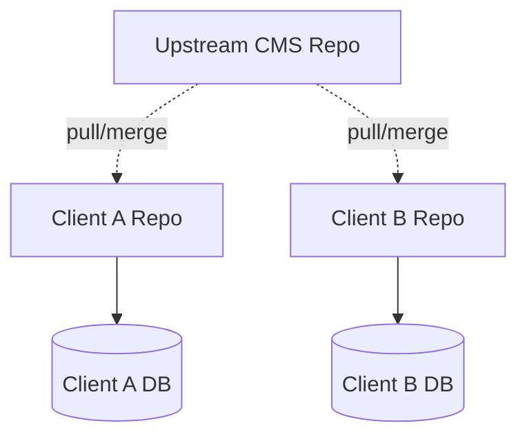
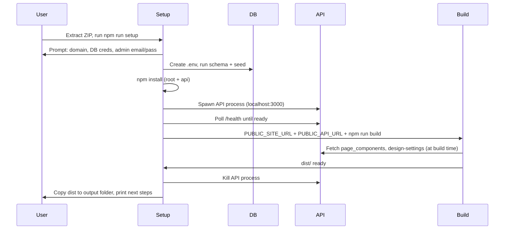

# Multi-Domain CMS: Deployment & Update Strategy

> **Plan status**: Living document. Incorporates product vision, roadmap, and technical prep for multi-domain deployment.
>
> **Primary deployment model**: ZIP + 1-click setup — extract on domain folder, run `npm run setup`, follow prompts. Like 1-click WordPress installation.

**Custom components:** The repo/ZIP includes `src/components/custom/` from the start (empty except README). Deploy and seed do not delete or overwrite that folder. New client domains have it by default; client-specific components go there and are never overwritten by upstream or seed.

---

## 1. Product Vision

### What We're Building

**The service**: Each client receives **their own website** — a fully standalone site with its own domain, content, and brand identity.

| Principle | Meaning |
|-----------|---------|
| **Standardized backend** | Same CMS engine, same 27-component library, same page builder, design system, and API. Every site runs the same proven stack. |
| **Extreme customization** | Clients access their pages and content via Admin → Page builder, Design & styling, Media, AI assemble. The content layer is fully under client control within the component schema. |
| **Pro model** | Future: An **entire AI agent** operates the site on behalf of the client. Content updates, SEO, publishing — automated within that client's instance. |
| **Standalone architecture** | **Each system is built standalone.** No shared multi-tenant backend. Each client has own DB, own deploy, own AI context. Enables Pro AI agent per site without cross-tenant leakage. |

### Why Standalone (Not Multi-Tenant SaaS)

- **Pro AI agent**: An AI agent per site needs full access to that site's content, design tokens, and pages. Standalone = clean scoping. No need for tenant isolation inside a shared AI layer.
- **Customization**: Client-specific overrides (brand, content, future custom components) live in that site's DB. No risk of one client's changes affecting another.
- **Blast radius**: A bug or failed deploy affects one client, not all.
- **Upgrades**: Core CMS updates flow via upstream → client pulls/merges. Client content stays in their DB, untouched.

---

## 2. Current State (Single Domain)

The project is hardcoded for one domain:

| Concern | Current Hardcoding |
|---------|-------------------|
| Site URL | `astro.config.mjs` → `site: 'https://lavprishjemmeside.dk'` |
| API URL | 15+ files use `'https://api.lavprishjemmeside.dk'` directly |
| Deploy paths | `.github/workflows/deploy.yml` → `~/lavprishjemmeside.dk/`, `~/repositories/lavprishjemmeside.dk` |
| Database | Single MySQL — no `site_id` in content tables (by design: one DB per site) |
| Publish trigger | `api/src/routes/publish.js` → hardcoded `kimjeppesen01/lavprishjemmeside.dk` GitHub repo |
| CORS, .env | `CORS_ORIGIN`, `PASSWORD_RESET_BASE_URL`, `GOOGLE_SITE_URL` all domain-specific |

---

## 3. Not Yet Implemented (from PROJECT_CONTEXT.md)

### Critical (Security & Performance)
- Automated log rotation for `security_logs` (archive/delete > 60 days)
- Change default admin password; force change on first login

### High Priority (Core Dashboard)
- Date range filtering (events/sessions with `?from=&to=`)
- Security logs page (`/admin/sikkerhed/`)
- User management (`/admin/brugere/`)
- Content pages management (`/admin/sider/`)
- Change password feature (`PUT /auth/password`)

### Medium Priority (UX & Analytics)
- Charts/trends visualization (events per day, sessions over time)
- Session detail view (full page flow)
- Global toast notifications
- Auto-refresh dashboard
- Mobile-responsive admin improvements
- Data export (CSV)

### Nice-to-Have
- UTM parameter tracking
- Core Web Vitals tracking
- Client-side error tracking
- Keyboard navigation & ARIA
- System-aware dark mode

### Pending (Product)
- Component editor UX: drag-and-drop reordering of array items
- Component variations: A/B content support per component instance
- Public pages: Priser, Om os, Kontakt
- SEO content optimization

### Future (Pro Model)
- Phase 7: AI Building Block Generator (`/admin/byggeklodser`) — mockup → components
- **Pro AI agent**: Full AI agent operating the site (content updates, SEO, publishing)

---

## 4. Deployment Model: Standalone Template

**Architecture**: Each client = own repo (fork or template), own cPanel setup, own MySQL DB.



### Deploy (New Domain)
1. Create from template or fork upstream repo
2. cPanel: add domain, clone repo, create MySQL, create `api.<domain>`, Node.js app
3. Create `.env` (site URL, API URL, DB, CORS, GITHUB_REPO)
4. GitHub secrets + workflow env vars
5. Run schema + seed components

### Update Flow (Push Core CMS Changes)
1. You push to upstream repo
2. Client runs `git pull upstream main` (or "Sync fork")
3. Client redeploys (or CI auto-deploys on push)
4. Client content untouched (lives in their DB)

---

## 5. Implementation Phases

### Phase 1: Shared Groundwork (Required for All Standalone Instances)

**1.1 Environment-based configuration**
- Astro: `PUBLIC_SITE_URL`, `PUBLIC_API_URL` (replace hardcoded URLs in 15+ files)
- API: `CORS_ORIGIN`, `PASSWORD_RESET_BASE_URL`, etc. from `.env`
- Build script (`scripts/generate-theme.mjs`): use `PUBLIC_API_URL`

**1.2 Parameterized deploy workflow**
- Workflow inputs or repo secrets: `DEPLOY_SITE_ROOT`, `DEPLOY_REPO_PATH`, `DEPLOY_DIST_TARGET`
- Keep `lavprishjemmeside.dk` as default

**1.3 Configurable publish trigger**
- Add `GITHUB_REPO` to `api/.env`
- `api/src/routes/publish.js`: use `process.env.GITHUB_REPO` instead of hardcoded repo

### Phase 2: Intuitive Deploy for New Domains — **Implemented**

**2.1 Deploy documentation**
- `docs/DEPLOY_NEW_DOMAIN.md` — step-by-step checklist (cPanel, MySQL, Node.js App, GitHub secrets/vars, schema order)
- `scripts/setup-domain.mjs` — interactive prompts; outputs suggested `api/.env`, GitHub Variables, and checklist

**2.2 Upstream update flow**
- `docs/UPSTREAM_UPDATES.md` — how clients pull upstream, resolve conflicts, redeploy
- Recommends: only `api/.env` and project-specific config are local; `src/`, `api/` (code), `.github/` merge from upstream

### Phase 3: Verification — **Implemented**

- `scripts/verify-deploy.mjs` — health check, design-settings, page-components for given `PUBLIC_API_URL`; optional live site HEAD if `PUBLIC_SITE_URL` set
- `npm run verify` in package.json

---

## 6. Files to Change (Phase 1)

**Status: Phase 1 implemented.** Env-based URLs and parameterized deploy are in place.

| Phase | Key Files | Done |
|-------|-----------|------|
| 1.1 | `astro.config.mjs`, `src/**/*.astro`, `scripts/generate-theme.mjs`, `public/.htaccess` | ✓ |
| 1.2 | `.github/workflows/deploy.yml` | ✓ |
| 1.3 | `api/src/routes/publish.js`, `api/.env.example` | ✓ |

**Env vars:** Root `.env.example`: `PUBLIC_SITE_URL`, `PUBLIC_API_URL`. API `.env`: `CORS_ORIGIN`, `PASSWORD_RESET_BASE_URL`, `GOOGLE_SITE_URL`, `GITHUB_REPO` (optional). GitHub Actions vars (optional): `PUBLIC_SITE_URL`, `PUBLIC_API_URL`, `DEPLOY_REPO_PATH`, `DEPLOY_SITE_ROOT`.

**Phase 2 (implemented):** `docs/DEPLOY_NEW_DOMAIN.md`, `docs/UPSTREAM_UPDATES.md`, `scripts/setup-domain.mjs`.

---

## 7. Risk: Updates Breaking Client Sites

| Risk | Mitigation |
|------|------------|
| Merge conflicts | Clients avoid customizing shared code; only config (env) is local |
| Breaking schema changes | Upstream uses additive migrations; document breaking changes in changelog |
| Breaking component props | Schema validation before save; `normalizeProps()` safety net; AI prompts include exact interfaces |
| Stale client sites | Document update cadence; optional "update available" indicator in admin |

---

## 8. ZIP + 1-Click Installer (Primary Implementation Focus)

**Goal**: Extract a ZIP on a domain folder, run one command, and have the CMS fully installed — like 1-click WordPress. You manage hosting; deployment = unpack + run setup.

### 8.1 ZIP Package Contents

```
lavpris-cms/
├── api/                     # Full API (no .env — created by setup)
├── public/
├── src/
├── scripts/
│   ├── generate-theme.mjs
│   └── setup.cjs            # NEW: 1-click installer
├── package.json
├── astro.config.mjs
├── .env.dist                # Template (copied to api/.env by setup)
└── README_INSTALL.md        # Quick start: extract, run npm run setup
```

**Excluded from ZIP** (generated at setup): `node_modules/`, `dist/`, `api/.env`, `src/data/` (design-features, header-footer), `src/styles/theme.css`

### 8.2 Setup Flow (Single Command)



### 8.3 What the Setup Script Does (Step-by-Step)

| Step | Action |
|------|--------|
| 1 | Validate Node 18+ |
| 2 | **Prompts** (CLI): Site domain (e.g. `app.client.dk`), API subdomain (default `api.app.client.dk`), DB host (default `127.0.0.1`), DB name, DB user, DB password, Admin email, Admin password. Optional: `SETUP_INTERACTIVE=0` + env vars for non-interactive/CI use |
| 3 | Create `api/.env` from template, inject values |
| 4 | Connect to MySQL with mysql2, run schema files in order: `schema.sql` → `schema_password_reset` → `schema_phase6` → `schema_header_footer` → `schema_media` → `schema_page_meta` → `schema_ai_prompt_settings` → `schema_indexes` |
| 5 | Replace default admin: schema.sql inserts `admin@lavprishjemmeside.dk`. Setup runs `UPDATE users SET email=?, password_hash=? WHERE role='admin' LIMIT 1` with user-provided email + bcrypt hash |
| 6 | Run `seed_components_v2.sql` (or incremental if components exist) |
| 7 | `npm ci` (root) and `cd api && npm ci --production` |
| 8 | Spawn `node api/server.cjs` as child process with `DB_*` from .env |
| 9 | Poll `http://localhost:3000/health` until 200 (max 60s) |
| 10 | `PUBLIC_SITE_URL=https://domain PUBLIC_API_URL=https://api.domain npm run build` |
| 11 | Kill API child process |
| 12 | Copy `dist/*` to configurable output path (default: `../<domain>-public/` or `./deploy-output/`) |
| 13 | Print: "Setup complete. Next: 1) cPanel → Setup Node.js App. Root: [full path]/api. Startup: server.cjs. URL: api.domain. 2) Point domain document root to [output path]." |
| 14 | Optional: Write `deploy.sh` script for future manual deploys (build + copy) |

### 8.4 Prerequisites (User Must Do Before Setup)

| Prereq | Where | Notes |
|--------|-------|-------|
| Addon domain | cPanel → Domains | e.g. `app.client.dk` points to `~/app.client.dk/` |
| MySQL database | cPanel → MySQL | Create DB + user, grant ALL on DB |
| (Optional) API subdomain | cPanel → Domains | `api.app.client.dk` → same or separate folder |
| Node.js 18+ | cPanel → Setup Node.js App | Or use system Node from SSH |
| SSH access | — | To run `npm run setup` |

### 8.5 Schema Execution Order

The setup script runs SQL files in this order (respecting FK dependencies):

1. `api/src/schema.sql`
2. `api/src/schema_password_reset.sql`
3. `api/src/schema_phase6.sql`
4. `api/src/schema_header_footer.sql`
5. `api/src/schema_media.sql`
6. `api/src/schema_page_meta.sql`
7. `api/src/schema_ai_prompt_settings.sql`
8. `api/src/schema_indexes.sql`
9. `api/src/seed_components_v2.sql`

(Other incremental schemas like `schema_overlap_module`, `schema_media_v2` etc. — merge into main or run if `IF NOT EXISTS` safe.)

### 8.6 Handling API During Build

- **Prebuild** (`generate-theme.mjs`): Already falls back to defaults if API unreachable.
- **index.astro / [...slug].astro**: Fetch `page-components` at build. If API down → empty pages (graceful).
- **Setup**: Spawn API before build so seeded content is used. Build gets real homepage + dynamic paths from DB.

### 8.7 Output After Setup

- `dist/` or `deploy-output/` contains static site ready to serve
- User either: (a) points document root to that folder, or (b) copies contents to existing domain folder (e.g. `~/app.client.dk/`)
- API runs from `api/` via cPanel Node.js App — user configures once
- Admin at `https://app.client.dk/admin/` — login with email/password from setup

### 8.8 Post-Setup: Publish / Deploy

- **With GitHub Actions**: User adds repo, secrets, workflow — "Publicer" button triggers rebuild (current flow).
- **Without GitHub**: `deploy.sh` script: `PUBLIC_SITE_URL=... PUBLIC_API_URL=... npm run build && cp -R dist/* /path/to/docroot/`
- Setup can optionally create this script with the correct paths baked in

### 8.9 Implementation Checklist

**Prerequisite**: Phase 1 (env-based config) must be complete — all hardcoded URLs replaced with `PUBLIC_SITE_URL` / `PUBLIC_API_URL` so setup can inject values at build time.

- [x] Create `scripts/setup.cjs` — main installer (prompts or SETUP_INTERACTIVE=0 + env)
- [x] Create `api/.env.dist` — template; setup builds `api/.env` from answers
- [x] Add `npm run setup` to package.json
- [x] Schema runner: `api/run-schema.cjs` (mysql2, order from 8.5)
- [x] Admin user: `api/set-admin.cjs` (bcrypt, UPDATE users)
- [x] API spawn + health poll (60s) + kill in setup.cjs
- [x] Build with PUBLIC_SITE_URL / PUBLIC_API_URL
- [x] Copy dist to configurable output path (default ./deploy-output)
- [x] Write `README_INSTALL.md`
- [x] `scripts/create-zip.sh` + `npm run package` — produces `lavpris-cms-v1.1.zip` by default (with `ZIP_VERSION` override support; excludes runtime/local artifacts)
- [x] Phase 1 env vars in place

### 8.10 Optional: Web-Based Setup (v2)

For true "visit URL to install" (WordPress-style):

- Add `setup/` folder with minimal Express server
- Serves form: domain, DB creds, admin email/pass
- POST handler runs same logic as CLI setup (schema, seed, .env, spawn API, build, copy)
- User runs `node setup/server.cjs` once, visits `http://app.client.dk:3333/`, fills form, clicks Install
- After success: "Delete the setup/ folder for security"

---

## 9. Out of Scope (This Plan)

- Migration of existing lavprishjemmeside.dk to multi-tenant (we chose standalone)
- Custom domain SSL/DNS automation
- Pro AI agent implementation
- Billing or tenant provisioning UI
